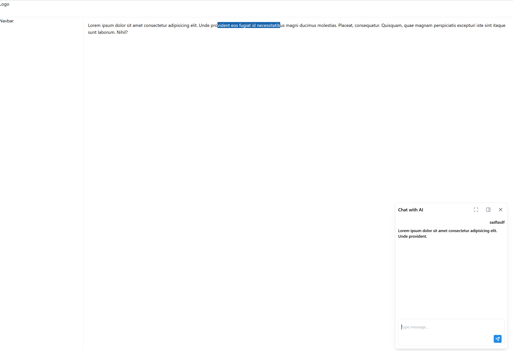
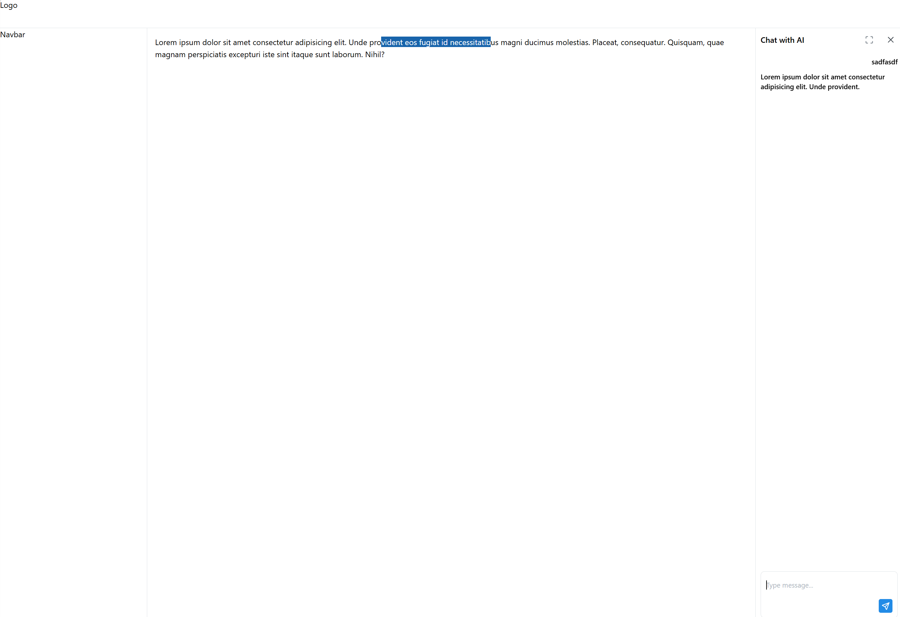
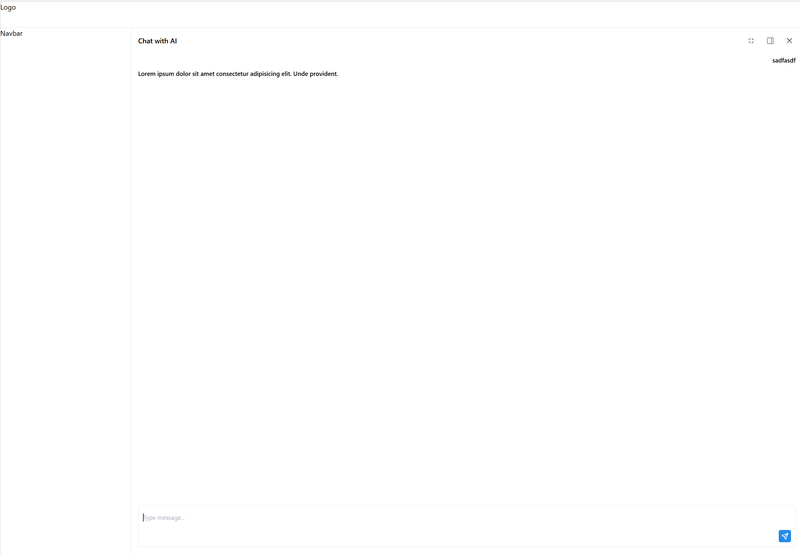

# Mantine Chat UI

A sample chat UI demo built with [Mantine](https://mantine.dev/), React, TypeScript, and Vite.

## What it demonstrates

- A floating chat dialog that can be opened via an action button
- Text selection in the main content triggers the chat to open
- The chat panel can be:
  - Expanded to full main content area
  - Moved to an aside sidebar
  - Minimized back to a dialog
- Persistent message history across panel layout changes
- Auto-scrolling to the latest message turn

## Getting started

```bash
npm install
npm run dev
```






